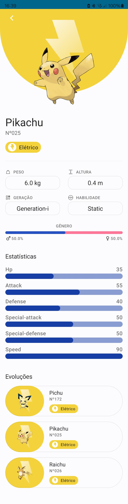

# Pokedex Android Project

 

This is an Android project that consists of a Pokedex, an application that allows viewing information about different Pokemon. The project is developed using the MVVM architecture with Clean Architecture, and employs various modern technologies for its implementation.

## Resources

- [PokeApi](https://pokeapi.co/)
- [Figma layout](https://www.figma.com/community/file/1202971127473077147/pokedex-pokemon-app)

## Technologies Used

To build this project, the following technologies were used:

- [**Jetpack Compose**](https://developer.android.com/courses/jetpack-compose/course?gad_source=1&gclid=Cj0KCQjwwMqvBhCtARIsAIXsZpYE_XOZY74zGbnCTBku2jGsJjwSRljtZB7eh-EgHX_hRVtRpFzWmDkaAh_FEALw_wcB&gclsrc=aw.ds): Modern framework for building declarative and responsive user interfaces.
- [**Compose Destinations**](https://github.com/raamcosta/compose-destinations): Library for navigation between screens in Jetpack Compose.
- [**Koin Annotations**](https://insert-koin.io/docs/reference/koin-annotations/start/): Dependency injection framework in Kotlin.
- [**Ktor**](https://ktor.io/docs/getting-started-ktor-client-multiplatform-mobile.html#build-script): Asynchronous HTTP client based on Kotlin for Android.
- [**Coil**](https://github.com/coil-kt/coil): Library for efficiently loading images on Android.
- [**Version Catalog Style Dependency Management**](https://developer.android.com/build/migrate-to-catalogs): Dependency management method that simplifies updating libraries to the latest versions.

## Features

This Pokedex app has two main screens:

### Pokemon List Screen

On the initial screen, a list of Pokemon is displayed, each represented by an image, its name, types, and number. Additionally, there is a button to favorite each Pokemon (favorite button is non-functional). When clicking on a Pokemon from the list, the user is redirected to the second screen.

### Pokemon Details Screen

On the second screen, detailed information about the selected Pokemon is displayed. In addition to the information from the first screen, the weight, height, generation, ability, gender ratio, and a list of Pokemon statistics are shown. Pokemon evolutions are also displayed.

## Screenshots

### Pokemon List

### Pokemon Details

## Next Steps

Some of the planned next steps for this project include:

- **Add Favorite and Save Favorite Pokemon Functionality**: Implement the ability to favorite Pokemon in the list and save favorite Pokemon locally using Room for data persistence.
- **Create Favorite Pokemon Screen**: Develop a dedicated screen to display the user's list of favorite Pokemon.
- **Integrate Room for Cache and Data Saving**: Implement integration with Room to cache API requests and save favorite Pokemon.
- **Add Pagination Functionality**: Implement pagination functionality to gradually load Pokemon and improve application performance.
- **Include SplashScreen with Compose API**: Add a SplashScreen using the Compose API for a smooth transition between app startup and the main screen.
- **Add Search and Filter Field**: Implement a search field to allow users to quickly find specific Pokemon and a filter field to filter Pokemon by type and generation.

## How to Contribute

If you wish to contribute to this project, follow these steps:

1. Fork the repository.
2. Create a branch for your modification (`git checkout -b feature/your-feature`).
3. Commit your changes (`git commit -am 'Add your feature'`).
4. Push your changes to the fork (`git push origin feature/your-feature`).
5. Open a Pull Request.

Any contributions are appreciated!

---

This project is developed and maintained by [Gean Brandão](https://github.com/geanbrandao). If you have any questions or issues, feel free to open an [issue](https://github.com/geanbrandao/Pokedex2.0/issues).
