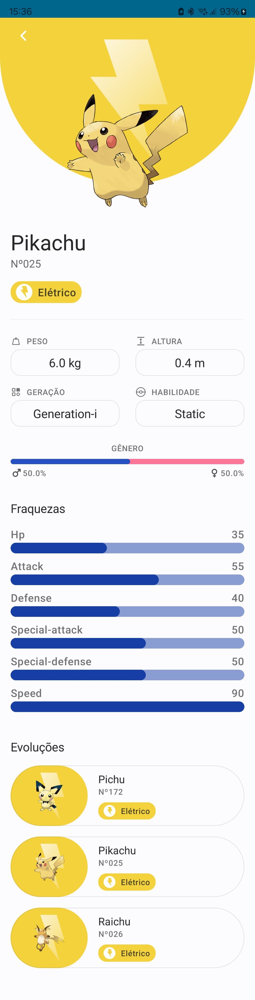
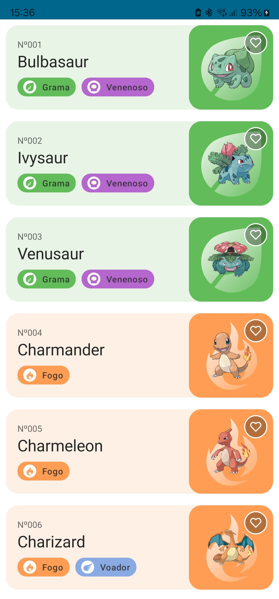

# Pokedex Android Project :brazil:

### [English Version](README-us.md)

 

Este é um projeto Android que consiste em uma Pokedex, uma aplicação que permite visualizar informações sobre diferentes pokemon. O projeto é desenvolvido utilizando a arquitetura MVVM com Clean Architecture, e emprega diversas tecnologias modernas para sua implementação.

## Recusos

- [PokeApi](https://pokeapi.co/)
- [Figma layout](https://www.figma.com/community/file/1202971127473077147/pokedex-pokemon-app)

## Tecnologias Utilizadas

Para construir este projeto, foram utilizadas as seguintes tecnologias:

- [**Jetpack Compose**:](https://developer.android.com/courses/jetpack-compose/course?gad_source=1&gclid=Cj0KCQjwwMqvBhCtARIsAIXsZpYE_XOZY74zGbnCTBku2jGsJjwSRljtZB7eh-EgHX_hRVtRpFzWmDkaAh_FEALw_wcB&gclsrc=aw.ds): Framework moderno para a construção de interfaces de usuário declarativas e responsivas.
- [**Compose Destinations**:](https://github.com/raamcosta/compose-destinations): Biblioteca para navegação entre telas no Jetpack Compose.
- [**Koin Annotations**:](https://insert-koin.io/docs/reference/koin-annotations/start/) Framework para injeção de dependência em Kotlin.
- [**Ktor**:](https://ktor.io/docs/getting-started-ktor-client-multiplatform-mobile.html#build-script) Cliente HTTP assíncrono baseado em Kotlin para Android.
- [**Coil**:](https://github.com/coil-kt/coil) Biblioteca para carregamento de imagens de forma eficiente em Android.
- [**Versionamento Estilo Catálogo**:](https://developer.android.com/build/migrate-to-catalogs) Método de gerenciamento de dependências que simplifica a atualização de bibliotecas para as versões mais recentes.

## Funcionalidades

Este aplicativo da Pokedex possui duas telas principais:

### Tela de Lista de Pokemon

Na tela inicial, é exibida uma lista de pokemon, cada um representado por uma imagem, seu nome, tipos e número. Além disso, há um botão para favoritar cada pokemon(botão favoritar está sem funcionalidade prática). Ao clicar em um pokemon da lista, o usuário é redirecionado para a segunda tela.

### Tela de Detalhes do Pokemon

Na segunda tela, são exibidas informações detalhadas sobre o pokemon selecionado. Além das informações da primeira tela, são mostrados o peso, altura, geração, habilidade, taxa de gênero e uma lista de estatísticas do pokemon. Também são exibidas as evoluções do pokemon.

## Screenshots

### Lista de Pokemon

### Detalhes do Pokemon

## Próximos Passos

Alguns dos próximos passos planejados para este projeto incluem:

- **Adicionar Função de Favoritar e Salvar Pokemon Favoritos**: Implementar a capacidade de favoritar pokemon na lista e salvar os pokemon favoritos localmente usando o Room para persistência de dados.
- **Criar Tela de Pokemon Favoritos**: Desenvolver uma tela dedicada para exibir a lista de pokemon favoritos do usuário.
- **Integrar Room para Cache e Salvamento de Dados**: Implementar integração com o Room para fazer cache das requests da API e salvar os pokemon favoritos.
- **Adicionar Função de Paginação**: Implementar a funcionalidade de paginação para carregar os pokemon gradativamente e melhorar o desempenho da aplicação.
- **Incluir SplashScreen com Compose API**: Adicionar uma SplashScreen utilizando a API do Compose para uma transição suave entre a inicialização do aplicativo e a tela principal.
- **Adicionar Campo de Pesquisa e Filtro**: Implementar um campo de pesquisa para permitir que os usuários encontrem pokemon específicos de forma rápida e um campo de filtro para filtrar os pokemon por tipo e geração.

## Como Contribuir

Se você deseja contribuir para este projeto, siga estas etapas:

1. Faça um fork do repositório.
2. Crie uma branch para sua modificação (`git checkout -b feature/sua-feature`).
3. Faça commit de suas alterações (`git commit -am 'Adicione sua feature'`).
4. Envie suas alterações para o fork (`git push origin feature/sua-feature`).
5. Abra um Pull Request.

Agradeço qualquer contribuição!

---

Este projeto é desenvolvido e mantido por [Gean Brandão](https://github.com/geanbrandao). Qualquer dúvida ou problema, sinta-se à vontade para abrir uma [issue](https://github.com/geanbrandao/Pokedex2.0/issues).
